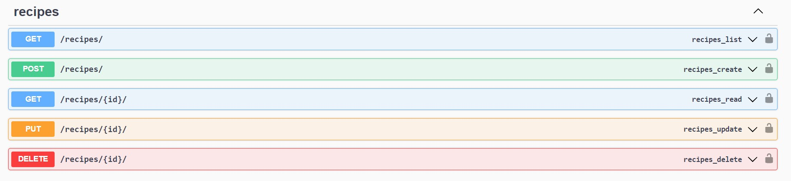
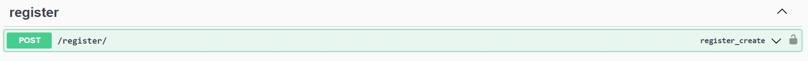
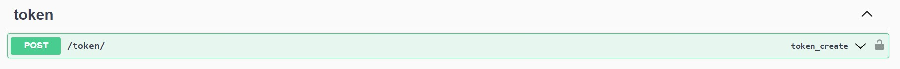
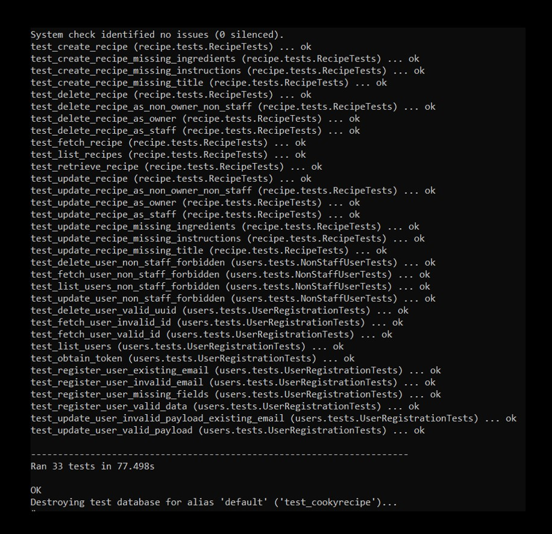
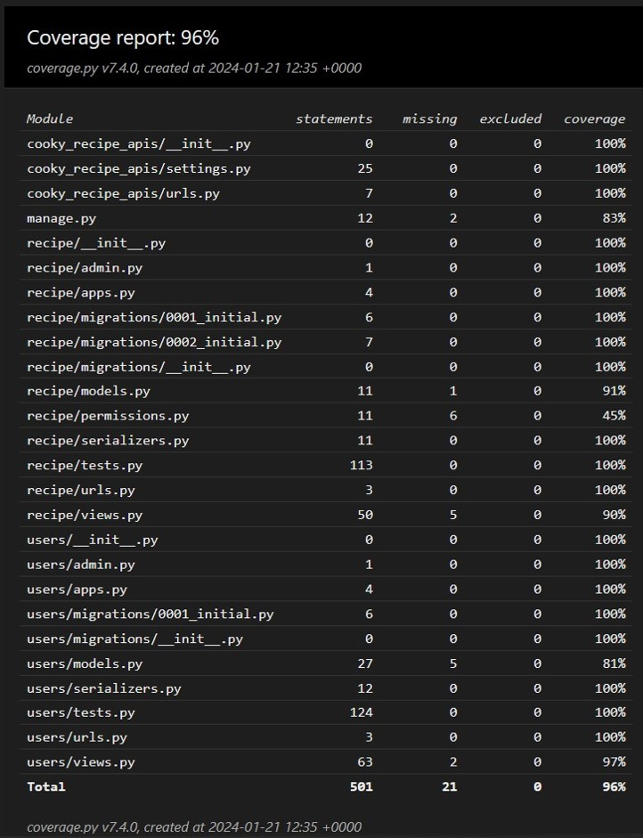

# Cooky API

## Overview

Cooky: Recipes from all over the world.

## Local Setup
You can set up and run this project using the traditional virtual environment approach or using docker:

### Using Docker

1. **Clone the Repository:**
   ```bash
   git clone https://github.com/IamMarkReyRonolo/cooky-recipe.git
   cd cooky-recipe

2. **Build and Run Docker Container:**
    ```bash
    docker-compose up --build -d

3. Access the documentation of the app at http://localhost:8000/swagger/

### Traditional Setup with `venv`

1. **Clone the Repository:**
   ```bash
   git clone https://github.com/IamMarkReyRonolo/cooky-recipe.git
   cd cooky-recipe

2. **Create and Activate Virtual Environment:**
    ```bash
    python3 -m venv venv
    source venv/bin/activate   # On Windows, use 'venv\Scripts\activate'

3. **Install Dependencies:**
    ```bash
    pip install -r requirements.txt

4. **Database Setup:**
    ```bash
    python manage.py migrate

5. **Run the Development Server:**
    ```bash
    python manage.py runserver

6. Access the documentation of the app at http://localhost:8000/swagger/

### Cooky APIs

1. **Recipe API**


2. **Registration API**


3. **Token API**


4. **Users API**


### Testing

1. **Running Tests**
    To run tests, use the following command:
    ```bash
    python manage.py test

- Sample Test Result



2. **To measure test coverage, you can use the coverage tool**
    ```bash
    coverage run manage.py test
    coverage report
    coverage html

- Sample Coverage Result


